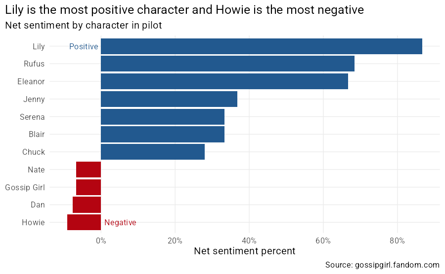

# gossip-girl

Data on the Gossip Girl TV series

Sourced from [Wikipedia](https://en.wikipedia.org/wiki/Gossip_Girl) and 
[gossipgirl.fandom.com](https://gossipgirl.fandom.com/wiki/Gossip_Girl_Wiki)

The purpose of this exercise is to provide some fun data for my niece to use when 
learning Excel.

If I can source some relationship information I can play with some network analysis, 
and some transcript information for text analysis using 
[{tidytext}](https://juliasilge.github.io/tidytext/).

Tables

- [x] Cast
- [x] Episodes
- [x] Relationships
- [x] Pilot transcript

XOXO

# Viewership

# Analysis of pilot transcript

